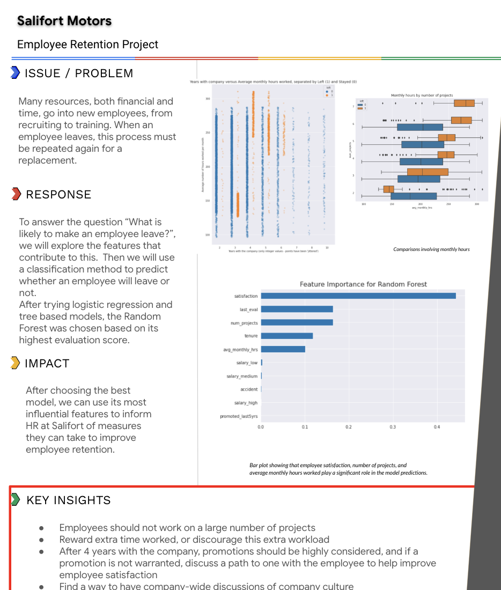
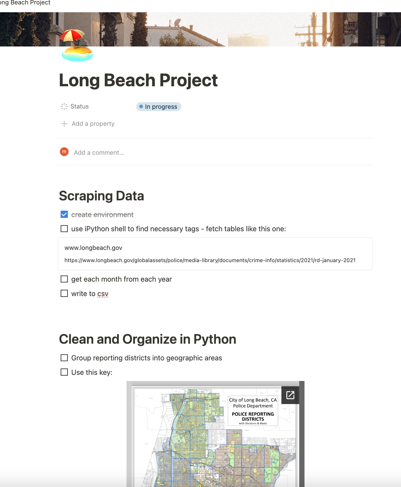
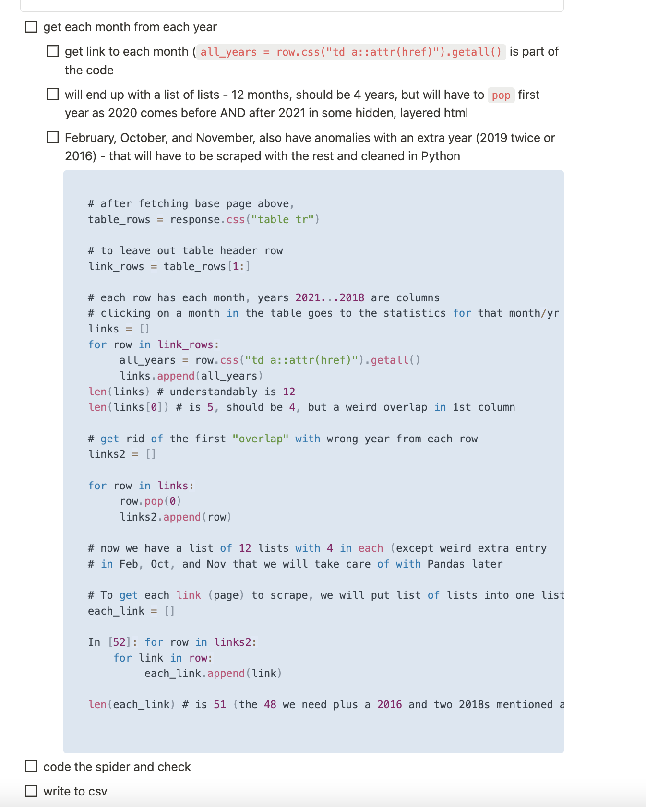

# Michelle Hapich

👋 Welcome to my portfolio   

Over the years I have done many projects to practice and apply skills I have learned. Below you will find just three of those that I would like to highlight.  
A brief description of each project:
- the capstone project from the Google Advanced Data Analytics Certificate - includes EDA, model building, model evaluation, and also a planning document and an executive summary that would be presented to stakeholders
- one dataset that I have created and uploaded to Kaggle - my own original idea to help with a need to more easily find cruelty free products
- one project that illustrates my use of four platforms to plan and execute quality deliverables - Notion for planning and organizing; VSCode to build a spider; Jupyter notebook for data aggregation, visualization, and analysis; Tableau for more interactive visualizations

---
# Project 1: Employee Churn at Salifort Motors
## [Google Advanced Data Analytics Project](https://github.com/mhapich/salifort-project) 
In this GitHub repository, you will find my PACE document with my project proposal, all of my analysis in a Jupyter notebook, and my executive summary.

**Overview**
The goal of this project is to help Salifort Motors determine how to keep a higher percentage of its employees.  This project utilizes data from a survey the company gave to close to 14000 employees. 

**Business Understanding**
The current rate of turnover of employees at Salifor Motors is close to 25%. This is costly both monetarily and in time and resources due to recruitment and training of new employees. Gauging the most influential factors leading to employee turnover (either quitting or being terminated) can give insights into what can possibly be changed to retain more satisfied employees.

**Data Understanding**
A survey was created and administered by HR at Salifort Motors. The data collected consists of approximately 15000 rows and 10 features. The features include employee satisfaction and employee evaluation scores, tenure at the company, salary categories, and whether the employee had been promoted in the last 5 years. Shown below are some of the relationships found in the data.

**Findings with Explanation**
The final model I chose to use to predict whether an employee would leave or not was a Random Forest. This model performed well in validation, and on test data it correctly predicted 93% of those employees who left. Among the most influential features in explaining employee turnover were employee satisfaction, monthly hours worked, and number of projects to which the employee contributes. Now that the company is aware of these factors, there are steps that can be taken to increase employee happiness and tenure. 

 

# Project 2: Cruelty-Free Company List
## [Cruelty Free Cosmetic Brands](https://github.com/mhapich/cruelty_free_products.git)

- I created a dataset which contains a list of cruelty-free brands from the website [Logical Harmony](https://logicalharmony.net/cruelty-free-brand-list/).
- Additional information about each brand includes whether its product line is vegan, if it is black-owned, and if its parent company is also cruelty-free
- Other information in the csv includes whether or not the brand is sold at one of five top retailers
- After scraping the products from multiple pages on the [Logical Harmony](https://logicalharmony.net/cruelty-free-brand-list/) website, I cleaned the data and put it into a dataset that I uploaded to [Kaggle](https://www.kaggle.com/datasets/mhapich/crueltyfree-brands)
- This dataset currently has a 14% download per view ratio, having been viewed over 1100 times and downloaded more than 150 times. It has been downloaded at least once every day since being published.

### Please see my interactive Tableau dashboard: ###
Here, you can search for a brand to find out more about it, or you can filter the lists to only see things like black-owned brands, brands that have parent companies that do utilize animal testing on other products, or brands that are both vegan and have a good parent company.
<b>[Cruelty-free products interactive tables](https://public.tableau.com/views/CrueltyFreeProducts/CrueltyFreeDashboard?:language=en-US&:display_count=n&:origin=viz_share_link)</b>

Some screenshots of Jupyter notebook explorations done while creating and cleaning the data:

  

# Project 3: Long Beach Crime Statistics vs. Apartment Prices
## [Long Beach Crime and Housing Analysis](https://github.com/mhapich/LongBeach)
- This project will be updated with daily progress
- BOY OH BOY - Lesson to the kids out there - once you get a dataset created, WRITE IT TO A FILE! I "coulda, shoulda, woulda" but had to step away from the project for 3 days. I wanted to verify correct month/year combo for each url written in, and when I went back to my project, I saw "no such link exists".  😭 Alllll of the links I had gotten (and DID write to a file), are now 404s.  The message from longbeach.gov's website is: "The City of Long Beach has learned that it was subject to a potential cyber security incident on November 14, 2023. Through the initial investigation, the City determined a network security incident occurred. While public safety services are not impacted, other city services may be affected for several days. Out of an abundance of caution, systems will be taken offline effective immediately during the investigation and potential remediation."
- I will leave my original description and progress up to this point here, and keep this as Project 3, hoping to be able to finish this once the City of Long Beach (hopefully) restores the content I was using

  
- The end goal is to be able to find the safest areas with the most affordable cost of living
- Project has been planned in *Notion* (images below)
- Used Scrapy to build a spider to get all url's from the month-by-month table on the main crime statistics page; wrote results to csv to use in Python notebook
- Used tabula package to extract statistics from pdfs
- Compiled data from all tables (all pages of all months) into one dataframe, adding the month and year as new columns

 

