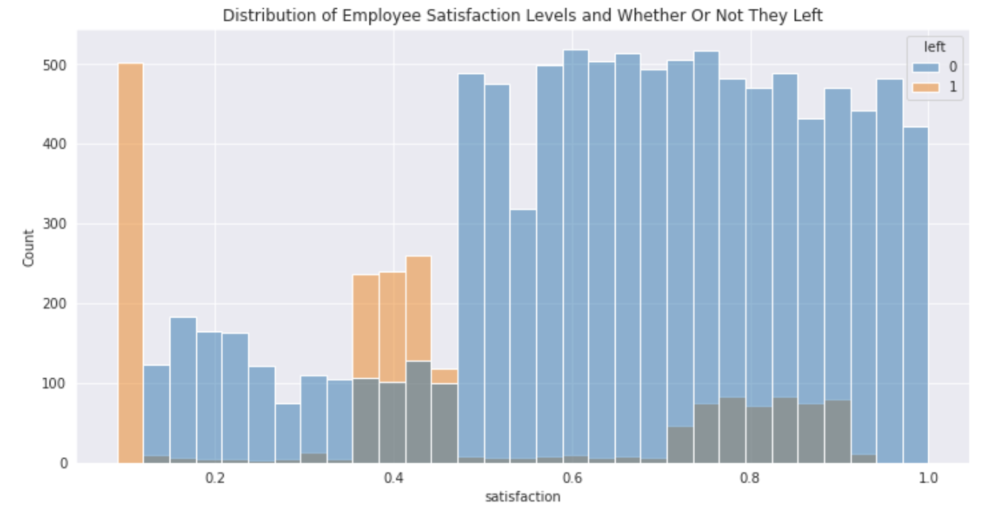
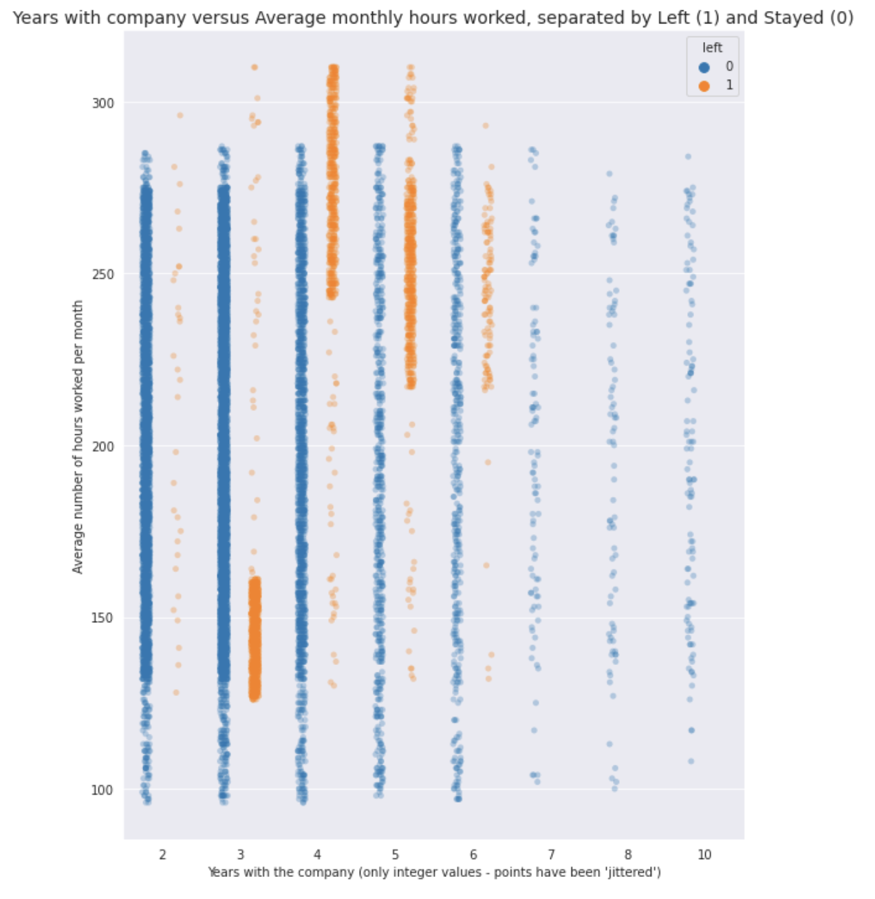
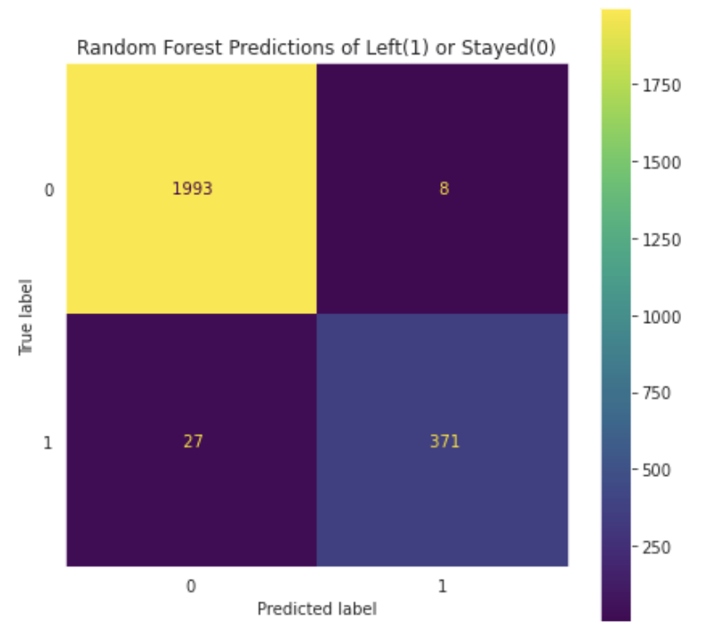

# Michelle Hapich

👋 Welcome to my portfolio

I'm passionate about data and all things math. I have a background in education and am transitioning from a career as a mathematics and computer science teacher to a career as a data professional. My journey into the world of data began when I discovered R helping a family friend in a nursing course. That led to my finding Datacamp and earning their Professional Data Scientist Certificate. At that point I was still developing my school district's computer science program, but it is now on its feet. This past summer I earned the Google Data Analytics Professional Certificate, and I just completed the last course of the Google Advanced Data Analytics Professional Certificate. The Capstone Project for that will be my new project #1, and will showcase not only my machine learning skills in Python, but also a structure that is essential in a business setting. Every project I completed followed a framework to help me document my steps along each stage, and included several executive summaries.

Throughout my teaching career, my favorite courses to teach were AP Calculus, Python, and Java, which cultivated my strong analytical and problem-solving skills. Now, I'm excited to apply my knowledge and expertise to tackle real-world data challenges. My love of helping others to learn is surpassed only by my own love of learning. Throughout this journey I have used Coursera, Udemy, Kaggle, books, YouTube tutorials, and other platforms to learn Linux, Github, SQL, web-scraping, linear algebra, statistics, and more.  As much as I have learned, I know I am just barely down the tip of the iceberg. I look forward to putting these skills to work, and to continue to learn and grow in this field.

---
# Project 1: Employee Churn at Salifort Motors
## [Google Advanced Data Analytics Project](https://github.com/mhapich/salifort-project) 
In this GitHub repository, you will find my PACE document with my project proposal, all of my analysis in a Jupyter notebook, and my executive summary.

**Overview**
The goal of this project is to help Salifort Motors determine how to keep a higher percentage of its employees.  This project utilizes data from a survey the company gave to close to 14000 employees. 

**Business Understanding**
The current rate of turnover of employees at Salifor Motors is close to 25%. This is costly both monetarily and in time and resources due to recruitment and training of new employees. Gauging the most influential factors leading to employee turnover (either quitting or being terminated) can give insights into what can possibly be changed to retain more satisfied employees.

**Data Understanding**
A survey was created and administered by HR at Salifort Motors. The data collected consists of approximately 15000 rows and 10 features. The features include employee satisfaction and employee evaluation scores, tenure at the company, salary categories, and whether the employee had been promoted in the last 5 years. Shown below are some of the relationships found in the data.

**Findings with Explanation**
The final model I chose to use to predict whether an employee would leave or not was a Random Forest. This model performed well in validation, and on test data it correctly predicted 93% of those employees who left. Among the most influential features in explaining employee turnover were employee satisfaction, monthly hours worked, and number of projects to which the employee contributes. Now that the company is aware of these factors, there are steps that can be taken to increase employee happiness and tenure. 

# Project 2: Cruelty-Free Company List
## [Cruelty Free Cosmetic Brands](https://github.com/mhapich/cruelty_free_products.git)

- I created a dataset which contains a list of cruelty-free brands from the website [Logical Harmony](https://logicalharmony.net/cruelty-free-brand-list/).
- Additional information about each brand includes whether its product line is vegan, if it is black-owned, and if its parent company is also cruelty-free
- Other information in the csv includes whether or not the brand is sold at one of five top retailers
- After scraping the products from multiple pages on the [Logical Harmony](https://logicalharmony.net/cruelty-free-brand-list/) website, I cleaned the data and put it into a dataset that I uploaded to [Kaggle](https://www.kaggle.com/datasets/mhapich/crueltyfree-brands)
- This dataset currently has a 14% download per view ratio, having been viewed over 1100 times and downloaded more than 150 times. It has been downloaded at least once every day since being published.

### Please see my interactive Tableau dashboard: ###
Here, you can search for a brand to find out more about it, or you can filter the lists to only see things like black-owned brands, brands that have parent companies that do utilize animal testing on other products, or brands that are both vegan and have a good parent company.
<b>[Cruelty-free products interactive tables](https://public.tableau.com/views/CrueltyFreeProducts/CrueltyFreeDashboard?:language=en-US&:display_count=n&:origin=viz_share_link)</b>

Some screenshots of Jupyter notebook explorations done while creating and cleaning the data:

  

# Project 3: Python to Tableau - Stock Market Prices
## [Stock Market Data and Dashboard](https://github.com/mhapich/nasdaq.git)
- In this repo you can see my Jupyter notebook, and also the many files that were containing the most recent stock prices and information up to that date.
- Using Pandas, I created several of the features I would later be using in Tableau.
- I will soon be updating this project. The update will contain different stocks - stocks I own, plus vegan stocks.
- The stock prices will be the most recent from Yahoo Finance.
- Here is a screenshot of my [Tableau interactive dashboard](https://public.tableau.com/views/StockMarketInteractiveDashboard/Dashboard1?:language=en-US&publish=yes&:display_count=n&:origin=viz_share_link) where you can change the dates and the company on which to focus.
- I will also be creating and linking a new, more original Tableau dashboard.

  

