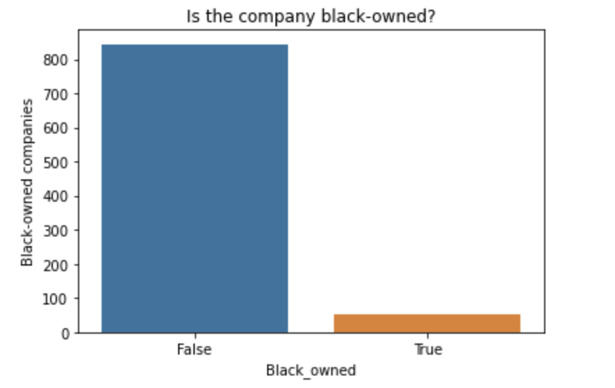
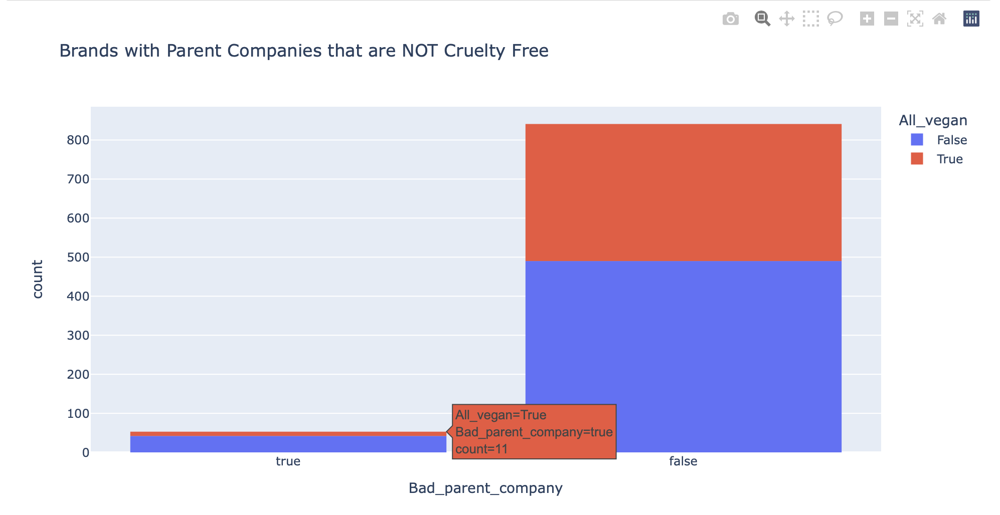
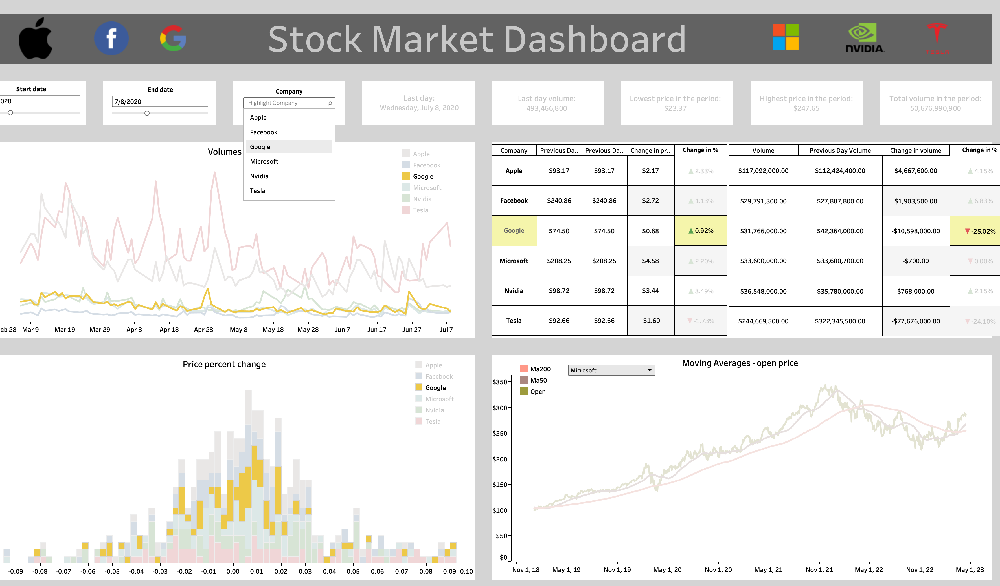
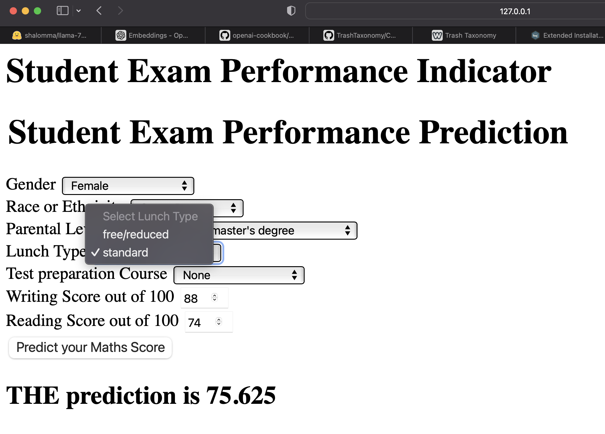

# Michelle Hapich's Portfolio

Yep, I'm a high school math teacher - teaching AP Calculus AB and BC and AP Computer Science and Python.  
So why hire me as your latex salesman?  ...I mean...Data Scientist?  
Take a look!!
(*also, if you're a Seinfeld fan, I had you at* latex salesman)

# Project 1: True Crime YouTubers
## [True Crime YouTube Channel Statistics](https://github.com/mhapich/trueCrime)
- This is just the beginning of this project!
- I have gathered and compiled channel statistics of 21 of my favorite YouTube channels that regularly post true crime stories.
- Where I am going from here:
  - use NER NLP on Title column and also Description column to find the name of the "perpetrator" for each video
  - use a crime database to find locations for the crimes
  - create a new set with locations to be used in a Tableau analysis with mapped crimes
  - do other things I haven't thought of yet, but will as I continue down this path

Here are some Seaborn plots from the notebook where I created the dataset:
 

  

# Project 2: Cruelty-Free Company List
## [Cruelty Free Cosmetic Brands](https://github.com/mhapich/cruelty_free_products.git)

- I created a dataset which contains a list of cruelty-free brands from the website [Logical Harmony](https://logicalharmony.net/cruelty-free-brand-list/).
- Additional information about each brand includes whether its product line is vegan, if it is black-owned, and if its parent company is also cruelty-free
- Other information in the csv includes whether or not the brand is sold at one of five top retailers
- After scraping the products from multiple pages on the [Logical Harmony](https://logicalharmony.net/cruelty-free-brand-list/) website, I cleaned the data and put it into a dataset that I uploaded to [Kaggle](https://www.kaggle.com/datasets/mhapich/crueltyfree-brands)
- This dataset currently has a 14% download per view ratio, having been viewed over 1100 times and downloaded more than 150 times. It has been downloaded at least once every day since being published.

### Please see my interactive Tableau dashboard: ###
Here, you can search for a brand to find out more about it, or you can filter the lists to only see things like black-owned brands, brands that have parent companies that do utilize animal testing on other products, or brands that are both vegan and have a good parent company.
<b>[Cruelty-free products interactive tables](https://public.tableau.com/views/CrueltyFreeProducts/CrueltyFreeDashboard?:language=en-US&:display_count=n&:origin=viz_share_link)</b>

Some screenshots of Jupyter notebook explorations done while creating and cleaning the data:

  

# Project 3: Python to Tableau - Stock Market Prices
## [Stock Market Data and Dashboard](https://github.com/mhapich/nasdaq.git)
- In this repo you can see my Jupyter notebook, and also the many files that were containing the most recent stock prices and information up to that date.
- Using Pandas, I created several of the features I would later be using in Tableau.
- Here is a screenshot of my [Tableau interactive dashboard](https://public.tableau.com/views/StockMarketInteractiveDashboard/Dashboard1?:language=en-US&publish=yes&:display_count=n&:origin=viz_share_link) where you can change the dates and the company on which to focus.

  

# Project 4: Student Data with Math Test Score Predictions
## [End to End CI/CD Machine Learning Project](https://github.com/mhapich/CICDnewProject.git)
- This was the project I used to learn modular coding, complete with a Flask app, and modules for data ingestion, data transformation, and model training.
- The application can be deployed using continuous integration and continuous deployment pipelines in AWS cloud
- The machine learning app can also be deployed using Github Actions with Azure App Service

  

# Project 5: Data cleaning for district students' transcripts

## [Transcript data cleaning](https://github.com/mhapich/transcript_cleaning.git)

- This repo contains only the notebook file used to show the tasks done to find potential problems in data entry in our district's student information system (SIS).  
- There were problems with some data in the SIS that were causing discrepancies in the class ranks.  I assisted the technology supervisor and guidance department in finding these problems.  I exported this notebook as a simple to navigate pdf with notes on students whose information needed changed.
- I had to anonymize student identifiers to publish this notebook.  Because of this, the original csv file containing student names and id numbers is not included in this repo.

Some topics for further analysis...

 
One of the data entry mistakes:

   

