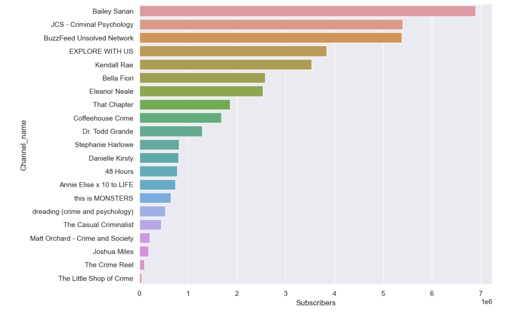
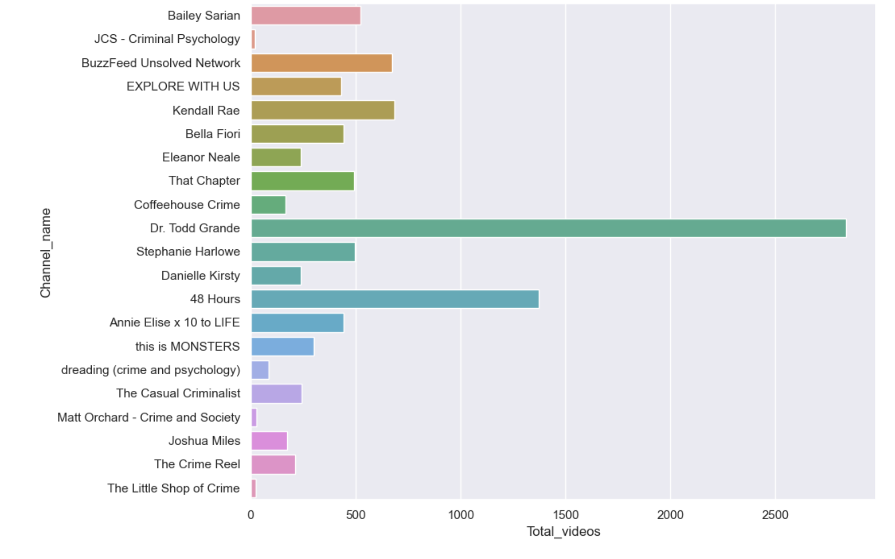

# Michelle Hapich

👋 Welcome to my Github portfolio!

I'm a passionate and dedicated data professional with a background in education, transitioning from being a mathematics and computer science teacher to pursuing a career as a data scientist and data analyst. My journey into the world of data began when I earned a Professional Data Scientist Certificate from Datacamp, and I'm currently working on my final project to complete the Google Data Analytics Professional Certificate.

Throughout my teaching career, I had the privilege of guiding students in AP Calculus, Python, and Java, which cultivated my strong analytical and problem-solving skills. Now, I'm excited to apply my knowledge and expertise to tackle real-world data challenges, deriving valuable insights and making data-driven decisions.

My Github showcases a collection of projects, analyses, and visualizations that demonstrate my proficiency in data manipulation, statistical analysis, and machine learning. With each endeavor, I strive to embrace the power of data in driving innovation and problem-solving across various domains.

I am actively seeking opportunities in the data science and data analytics field, where I can leverage my diverse background and data expertise to contribute meaningfully to projects and teams.

Feel free to explore my repositories, and don't hesitate to reach out for collaboration or job opportunities. Let's connect and explore the endless possibilities of data together!

---

Feel free to modify it to align with your personal preferences and style. Best of luck with your job search and your data journey!

# Project 1: Python to Tableau - Stock Market Prices
## [Stock Market Data and Dashboard](https://github.com/mhapich/nasdaq.git)
- In this repo you can see my Jupyter notebook, and also the many files that were containing the most recent stock prices and information up to that date.
- Using Pandas, I created several of the features I would later be using in Tableau.
- Here is a screenshot of my [Tableau interactive dashboard](https://public.tableau.com/views/StockMarketInteractiveDashboard/Dashboard1?:language=en-US&publish=yes&:display_count=n&:origin=viz_share_link) where you can change the dates and the company on which to focus.

  

# Project 2: Cruelty-Free Company List
## [Cruelty Free Cosmetic Brands](https://github.com/mhapich/cruelty_free_products.git)

- I created a dataset which contains a list of cruelty-free brands from the website [Logical Harmony](https://logicalharmony.net/cruelty-free-brand-list/).
- Additional information about each brand includes whether its product line is vegan, if it is black-owned, and if its parent company is also cruelty-free
- Other information in the csv includes whether or not the brand is sold at one of five top retailers
- After scraping the products from multiple pages on the [Logical Harmony](https://logicalharmony.net/cruelty-free-brand-list/) website, I cleaned the data and put it into a dataset that I uploaded to [Kaggle](https://www.kaggle.com/datasets/mhapich/crueltyfree-brands)
- This dataset currently has a 14% download per view ratio, having been viewed over 1100 times and downloaded more than 150 times. It has been downloaded at least once every day since being published.

### Please see my interactive Tableau dashboard: ###
Here, you can search for a brand to find out more about it, or you can filter the lists to only see things like black-owned brands, brands that have parent companies that do utilize animal testing on other products, or brands that are both vegan and have a good parent company.
<b>[Cruelty-free products interactive tables](https://public.tableau.com/views/CrueltyFreeProducts/CrueltyFreeDashboard?:language=en-US&:display_count=n&:origin=viz_share_link)</b>

Some screenshots of Jupyter notebook explorations done while creating and cleaning the data:

  

# Project 3: True Crime YouTubers
## [True Crime YouTube Channel Statistics](https://github.com/mhapich/trueCrime)
- This is is an ongoing project by design.  The more I discover, the more I explore! 
- So far, I have gathered and compiled channel statistics and video information using the YouTube API from 21 of my favorite True Crime YouTube channels.
- I used spaCy to find names of perpetrators or victims of crimes from channel data
- I created a new DataFrame with these names and each channel that covered that event
- I have a top 20 list of the most covered cases
- The in-progress part of this project: gathering location data for crimes covered in these channels. I will use Tableau to visualize incidents on a map, hoping to uncover patterns
- The dataset is now shared on [Kaggle](https://www.kaggle.com/datasets/mhapich/true-crime-channel-statistics) 

Here are some Seaborn plots from the notebook where I created the dataset:
 

  

# Project 4: Student Data with Math Test Score Predictions
## [End to End CI/CD Machine Learning Project](https://github.com/mhapich/CICDnewProject.git)
- This was the project I used to learn modular coding, complete with a Flask app, and modules for data ingestion, data transformation, and model training.
- The application can be deployed using continuous integration and continuous deployment pipelines in AWS cloud
- The machine learning app can also be deployed using Github Actions with Azure App Service

  

# Project 5: Data cleaning for district students' transcripts

## [Transcript data cleaning](https://github.com/mhapich/transcript_cleaning.git)

- This repo contains only the notebook file used to show the tasks done to find potential problems in data entry in our district's student information system (SIS).  
- There were problems with some data in the SIS that were causing discrepancies in the class ranks.  I assisted the technology supervisor and guidance department in finding these problems.  I exported this notebook as a simple to navigate pdf with notes on students whose information needed changed.
- I had to anonymize student identifiers to publish this notebook.  Because of this, the original csv file containing student names and id numbers is not included in this repo.

Some topics for further analysis...

 
One of the data entry mistakes:

   

